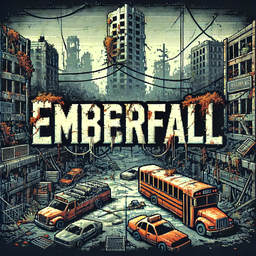
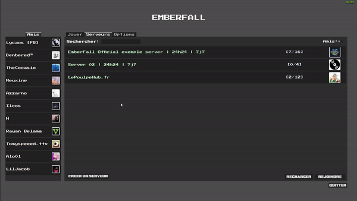

<h1>
  
  Emberfall
</h1>

Emberfall 💀 est un projet de jeu multijoueur top-down que je développe pour m'initier à Godot et réaliser mon rêve de créer un petit jeu amusant à jouer entre amis.  
Ce jeu se déroulera dans un monde post-apocalyptique infesté de zombies, où les joueurs devront coopérer pour survivre à des ennemis de plus en plus coriaces au fil de leur aventure.  

👽 Inspiré de **Project Zomboid** et **Forager**.

## 🛠️ Fonctionnalités

🌟 Vue de dessus avec effets de lumière dynamiques.  
🎮 Support multijoueur.  
🧟‍♂️ Vagues d'ennemis.  
🎮 Contrôles du joueur.  
⚙️ Menu d'options pour les configurations de touches, affichage et audio.  

## 📅 Roadmap

#### 🎨 UI/UX :
- [x] Création d'un menu utilisateur  
- [🚧] Faire l'onglet 'Jouer'  
- [🚧] Mise en place des options (design/audio/options/touches)  
- [x] Intégration d'amis Steam en direct/en jeu  
- [x] Visualisation des serveurs en ligne  
- [x] Permettre aux utilisateurs de créer leur propre serveur  
- [🚧] Implémentation de l'invitation/rejoindre un ami/serveur  
- [🚧] Mettre une image de serveur par défaut si l'utilisateur ne choisi pas d'image  
- [🚧] Permettre aux joueurs non-Steam de créer un compte avec pseudo et photo de profil
#### 🎮 Gameplay :
- [ ] Refaire tous les squelettes du jeu (Joueur/Ennemis/Items)  
- [ ] Revoir les mécaniques du joueur à partir de zéro  
- [ ] Développer la classe abstraite pour les ennemis  
- [ ] Créer différentes armes avec leur propre propriété  
- [ ] Ajout d'items au sol (Armes/pièces/etc..)  
- [ ] Système de lumière autour du joueur  
- [ ] Ajouter un HUD au gameplay  
#### 🔊 Audio :
- [ ] Ajouter de la musique/sfx  
#### 🔨 Autres :
- [🚧] Kick les joueurs du serveur si l'Owner se déconnecte  
- [ ] Revoir les sauvegardes de paramètres et de parties pour une meilleure compatibilité
- [ ] Mise en place de sauvegarde des paramètres  
- [ ] Mise en place de sauvegarde de parties  

## 👀 Aperçu actuel

### 📝 Auteur
- 🎫 [@NineSuper](https://www.github.com/NineSuper)
